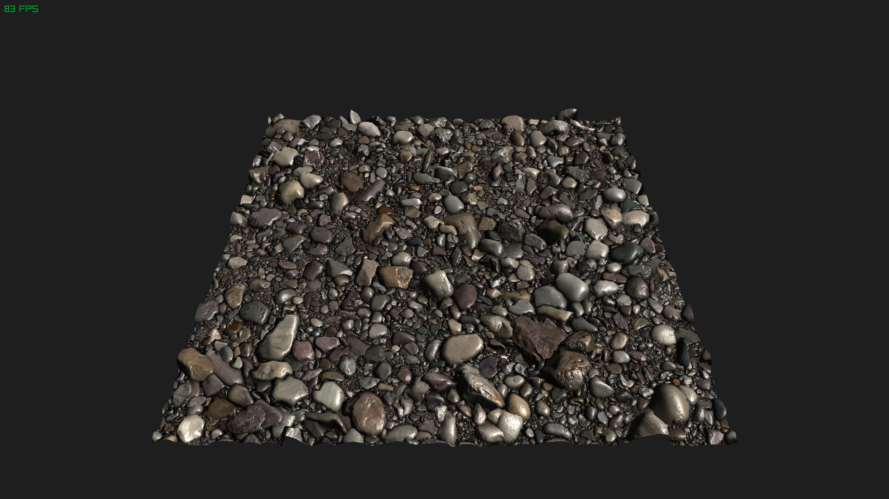

# hgl
A collection of small (except maybe hgl\_rita.h) easy-to-use header only libraries written in C.

| **library**           | **Category**                  | **Description**                                                                                         |
|-----------------------|-------------------------------|---------------------------------------------------------------------------------------------------------|
| hgl\_arena\_alloc.h   | Allocator                     | Arena allocator.                                                                                        |
| hgl\_stack\_alloc.h   | Allocator                     | Stack allocator (requires hgl\_arena\_alloc.h).                                                         |
| hgl\_pool\_alloc.h    | Allocator                     | Pool allocator.                                                                                         |
| hgl\_fs\_alloc.h      | Allocator                     | A "free stack" allocator. Similar to other free list allocators.                                        |
| hgl\_memdbg.h         | Allocator/Utility             | Quick and easy leak checking replacement for malloc, realloc, and free.                                 |
| hgl\_vector.h         | Data Structure                | Typed\* dynamic (resizable) array.                                                                      |
| hgl\_da.h             | Data Structure                | Macro-only generic dynamic array implementation.                                                        |
| hgl\_q.h              | Data Structure                | Macro-only generic queue (circular buffer) implementation.                                              |
| hgl\_tq.h             | Data Structure/Thread Utility | Macro-only generic synchronized (thread) queue implementation.                                          |
| hgl\_hash\_table.h    | Data Structure                | Typed\* Robin Hood style hash table/map.                                                                |
| hgl\_htable.h         | Data Structure                | Basically hgl\_hash\_table.h, but without the type stuff.                                               |
| hgl\_hset.h           | Data Structure                | Basically hgl\_htable.h, but without the value.                                                         |
| hgl\_ring\_buffer.h   | Data Structure                | Typed\* circular buffer.                                                                                |
| hgl\_rbtree.h         | Data Structure                | Your CS professor's ye olde red-black tree.                                                             |
| hgl\_chan.h           | Data Structure/Thread Utility | Typed\* synchronized message passing utility. Similar to Go's channels.                                 |
| hgl\_buffered\_chan.h | Data Structure/Thread Utility | Typed\* and buffered synchronized message passing utility. Similar to Go's buffered channels.           |
| hgl\_string.h         | Data Strucutre/Utility        | Dynamic string builder, sized strings, and easy-to-use string operations.                               |
| hgl\_sockets.h        | Networking/Utility            | A simple to use wrapper around Linux sockets (TCP/UDP)                                                  |
| hgl\_worker\_pool.h   | Multithreading/Utility        | Thread/Worker pool.                                                                                     |
| hgl\_barrier.h        | Multithreading/Utility        | Barrier synchronization primitive.                                                                      |
| hgl\_hotload.h        | Utility                       | Quick and easy hotloading.                                                                              |
| hgl\_profile.h        | Utility                       | Quick and dirty profiling.                                                                              |
| hgl\_process.h        | Utility                       | Utility for spawning, running, and chaining together subprocesses. Basically execvp minus the headache. |
| hgl\_serialize.h      | Utility                       | Powerful binary parsing and serializing/unserializing with a simple regex-like language.                |
| hgl\_cmd.h            | Utility                       | Simple command prompt user interface with tab completion.                                               |
| hgl\_flags.h          | Utility                       | Simple utility for parsing command-line arguments.                                                      |
| hgl\_ini.h            | Utility                       | Simple utility for parsing (and generating) \*.ini files                                                |
| hgl\_io.h             | Utility                       | Simple file I/O.                                                                                        |
| hgl\_fft.h            | Algorithm                     | An implementation of the Fast Fourier Transform (FFT) using SIMD.                                       |
| hgl\_base64.h         | Algorithm                     | Base64 encoding and decoding.                                                                           |
| hgl\_rle.h            | Algorithm                     | Run-length encoding and decoding. Supports multiple data and run-length block sizes.                    |
| hgl\_hamming.h        | Algorithm                     | Hamming(16,11) encoding and decoding system.                                                            |
| hglm.h                | Math                          | Vector math library with some SIMD support.                                                             |
| hglm\_aliases.h       | Math                          | Aliases for hglm.h without `hglm_` and `Hglm` prefixes, to make things less wordy.                      |
| hgl\_test.h           | Unit Testing Framework.       | Simple but powerful unit testing framework.                                                             |
| hgl.h                 | Utility/Misc.                 | Misc. typedefs and macros that I use from time to time.                                                 |
| hgl\_rita.h           | 3D graphics/CPU rasterizer    | Multi-threaded (tiled) CPU-rasterizer and general purpose graphics library.                             |
| hgl\_rita\_shaders.h  | 3D graphics/CPU rasterizer    | A collection of ready-made shaders for hgl\_rita.h                                                      |

\* In this context "typed" means that the type of data that is held by the data
   structure can be set at compile time by defining one or two macros before including.

## Building

To build all examples and to build and run all tests, run:

```bash
$ make
```

To build all examples, run:

```bash
$ make examples
```

To build a specific example, run make followed by the name of the example program:

```bash
$ make fft
```

To build and run all tests, run:

```bash
$ make test
```

## hgl_rita.h
hgl_rita.h is a bit off an odd-one-out, since it's a quite bit larger and more complex than the rest of the libraries. Here's a couple images rendered using hgl_rita.h:


High-polygon photogrammetry of Loarre Castle (rita_castle.c)


High-polygon photogrammetry of Loarre Castle (rita_castle.c)


Demo of vertex+normal displacement using texture maps (rita_pebbles.c)


Demo of shader blit-ing with a 1BPP ordered dithering shader on a skull model (rita_3d.c)


High-polygon photogrammetry of a statue of H.C. Andersen


Conway's Game of Life implemented using only shader blit-ing

## Note
Some of the example programs contain relative paths into the `assets` directory. These must be run from
the root directory. E.g.:

```bash
$ ./build/examples/rita_pebbles_optimized
```

